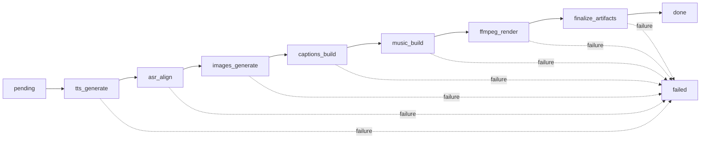

# ADR 0003: Idempotent 7-Step Render Pipeline

**Date**: 2026-01-31  
**Status**: Accepted  
**Decision Makers**: Development Team

## Context

The video rendering process involves multiple external API calls (OpenAI TTS, Whisper, DALL-E) and CPU-intensive operations (FFmpeg). Each step can fail due to:
- API rate limits or timeouts
- Network issues
- FFmpeg errors
- Disk space issues
- Out of memory errors

We needed a render pipeline that is:
- **Resumable**: Can continue from where it left off after failure
- **Observable**: Provides real-time progress updates to users
- **Cancellable**: Users can stop long-running renders
- **Testable**: Can be tested without expensive API calls
- **Maintainable**: Easy to add new steps or modify existing ones

## Decision

We will implement a **7-step idempotent render pipeline** where each step:

1. Checks if its output already exists (idempotent)
2. Executes its task if needed
3. Saves output to disk
4. Updates Run status in database
5. Broadcasts progress via SSE

### Pipeline Steps



### Step Details

| Step | Purpose | Output | Idempotent Check |
|------|---------|--------|------------------|
| 1. **tts_generate** | Generate voice-over | `audio.mp3` | File exists? |
| 2. **asr_align** | Get word timestamps | `transcription.json` | File exists? |
| 3. **images_generate** | Create scene images | `scene-*.png` | All files exist? |
| 4. **captions_build** | Generate subtitles | `captions.ass` | File exists? |
| 5. **music_build** | Add background music | `audio_with_music.mp3` | File exists? |
| 6. **ffmpeg_render** | Composite final video | `output.mp4` | File exists? |
| 7. **finalize_artifacts** | Verify & generate thumbnail | `thumb.jpg` + verify all | Thumbnail exists? |

### State Persistence

Each step updates the `Run` table:

```typescript
interface Run {
  id: string;
  status: 'pending' | 'tts_generate' | 'asr_align' | ... | 'done' | 'failed' | 'cancelled';
  progress: number;  // 0-100
  currentStep: string;
  logsJson: string;  // Array of log messages
  artifacts: { mp4Path, thumbPath, ... };
}
```

### Progress Broadcasting

Real-time updates via Server-Sent Events (SSE):

```typescript
// Server broadcasts after each step
broadcastRunUpdate(runId, {
  type: 'progress',
  step: 'images_generate',
  progress: 50,
  message: 'Generated 3/6 images'
});

// Client receives events
eventSource.onmessage = (event) => {
  const data = JSON.parse(event.data);
  updateProgressBar(data.progress);
};
```

## Consequences

### Positive

1. **Resumability**: Failed renders can be retried from the failed step
   - Saves API costs (don't re-generate already created images)
   - Faster iteration during development
   - Users don't lose partial progress

2. **Observability**: Real-time progress updates improve UX
   - Users see exactly what's happening
   - Can identify bottlenecks (e.g., "stuck on DALL-E generation")
   - SSE more efficient than polling

3. **Testability**: Dry-run mode enables testing without API calls
   ```env
   APP_RENDER_DRY_RUN=1  # Skip actual API calls
   APP_DRY_RUN_FAIL_STEP=images_generate  # Simulate failure at specific step
   ```

4. **Cancellability**: Active runs can be stopped mid-execution
   - Sets `cancelled` flag in Run record
   - Pipeline checks flag before each step
   - Cleans up partial artifacts

5. **Maintainability**: Steps are independent and well-defined
   - Easy to add new steps (e.g., quality checks, watermarks)
   - Each step has single responsibility
   - Clear error boundaries

### Negative

1. **Complexity**: More complex than monolithic render function
   - 7 separate step implementations
   - State machine logic
   - SSE connection management

2. **Disk Space**: Intermediate files consume space
   - TTS audio, transcription JSON, scene PNGs all saved separately
   - Mitigation: Cleanup old runs periodically (future task)

3. **Database Load**: Frequent status updates
   - Each step updates Run record
   - For high-concurrency, consider batch updates

4. **Failure Modes**: Partial state is possible
   - Files exist but Run record not updated → idempotent check fails
   - Database updated but files missing → verification fails
   - Mitigation: `finalize_artifacts` step verifies everything

### Trade-offs

- **Performance vs Reliability**: Saving after each step adds I/O overhead, but enables resumability
- **Disk Space vs API Costs**: Keeping intermediates costs disk space, but saves re-generation costs

## Alternatives Considered

### 1. Monolithic Render Function

```typescript
async function renderVideo(project, plan) {
  const audio = await generateTTS(plan.narration);
  const images = await generateImages(plan.scenes);
  const video = await renderFFmpeg(audio, images);
  return video;
}
```

**Pros**:
- Simpler implementation
- Fewer database updates
- Less disk I/O

**Cons**:
- No resumability (must restart from beginning on failure)
- No progress updates (user sees nothing for 2-5 minutes)
- Harder to test individual steps
- Can't cancel mid-execution

**Verdict**: Rejected due to poor UX and inability to resume

### 2. Message Queue (Bull/BullMQ)

**Pros**:
- Job retry built-in
- Persistent job state
- Horizontal scaling
- Job prioritization

**Cons**:
- Requires Redis infrastructure
- Significant complexity
- Overkill for single-server deployment

**Verdict**: Rejected for v1, consider for v2 if scaling needed

### 3. Serverless Functions (AWS Lambda)

**Pros**:
- Auto-scaling
- Pay-per-use
- No server management

**Cons**:
- 15-minute Lambda timeout (too short for full render)
- Complex step coordination
- Cold start latency
- Harder to debug

**Verdict**: Rejected because render pipeline often exceeds 15 minutes

## Implementation Details

### Render Pipeline Core (`apps/server/src/services/render/renderPipeline.ts`)

```typescript
export async function executeRenderPipeline(runId: string) {
  const steps = [
    { name: 'tts_generate', fn: generateTTS },
    { name: 'asr_align', fn: alignASR },
    { name: 'images_generate', fn: generateImages },
    { name: 'captions_build', fn: buildCaptions },
    { name: 'music_build', fn: buildMusic },
    { name: 'ffmpeg_render', fn: renderFFmpeg },
    { name: 'finalize_artifacts', fn: finalizeArtifacts },
  ];

  for (const step of steps) {
    // Check if cancelled
    const run = await prisma.run.findUnique({ where: { id: runId } });
    if (run.status === 'cancelled') break;

    // Check if step already completed (idempotent)
    if (await isStepCompleted(runId, step.name)) {
      continue;
    }

    // Execute step
    try {
      await step.fn(runId);
      await markStepCompleted(runId, step.name);
      broadcastRunUpdate(runId, { type: 'progress', step: step.name });
    } catch (error) {
      await markRunFailed(runId, step.name, error);
      throw error;
    }
  }

  await markRunDone(runId);
}
```

### Testing Strategy

```typescript
// Unit test individual steps
describe('generateTTS', () => {
  it('should create audio file', async () => {
    await generateTTS(runId);
    expect(fs.existsSync(`artifacts/${runId}/audio.mp3`)).toBe(true);
  });
});

// Integration test with dry-run
describe('render pipeline', () => {
  beforeEach(() => {
    process.env.APP_RENDER_DRY_RUN = '1';
  });

  it('should complete all steps', async () => {
    await executeRenderPipeline(runId);
    const run = await prisma.run.findUnique({ where: { id: runId } });
    expect(run.status).toBe('done');
  });
});

// Test failure recovery
describe('render pipeline failure', () => {
  it('should resume from failed step', async () => {
    process.env.APP_DRY_RUN_FAIL_STEP = 'images_generate';
    
    // First execution fails at step 3
    await expect(executeRenderPipeline(runId)).rejects.toThrow();
    
    // Second execution resumes from step 3
    delete process.env.APP_DRY_RUN_FAIL_STEP;
    await executeRenderPipeline(runId);
    
    const run = await prisma.run.findUnique({ where: { id: runId } });
    expect(run.status).toBe('done');
  });
});
```

## Future Enhancements

### Parallel Step Execution

~~Some steps could run in parallel:~~
~~- `images_generate` (all scenes simultaneously)~~
~~- `tts_generate` + `music_build` (independent)~~

**Status**: ✅ **Implemented** (2026-02-01)

**Implementation**: `images_generate` step now uses `p-limit` to generate images concurrently:
- Default concurrency: 3 concurrent requests
- Configurable via `MAX_CONCURRENT_IMAGE_GENERATION` environment variable
- Uses `p-limit` library for controlled concurrency
- Maintains all existing features: caching, dry-run, cancellation, error handling
- Progress tracking updates after each completed image

**Results**:
- End-to-end render time reduced for multi-scene projects (30-50% faster for projects with 6+ scenes)
- Resource usage controlled to prevent OpenAI API overload
- All existing tests pass with parallel implementation
- Comprehensive unit tests added for concurrency patterns

**Future Work**:
- `tts_generate` + `music_build` parallel execution (requires dependency analysis)
- Dynamic concurrency adjustment based on API rate limits

~~**Complexity**: Requires job queue and worker pool~~

~~**Benefit**: 30-50% faster renders~~

~~**Priority**: Medium (implement in v2)~~

### Checkpoint Compression

After `ffmpeg_render`, delete intermediate files to save space.

**Trade-off**: Can't resume from failure after compression

**Implementation**: Add `cleanup_intermediates` optional step

### Quality Checks Step

Add `qa_check` step between `images_generate` and `captions_build`:
- Verify image quality
- Check for NSFW content
- Validate scene consistency

**Priority**: Low (nice-to-have)

## Related Decisions

- [ADR 0001: Record Architecture Decisions](0001-record-architecture-decisions.md)
- [ADR 0002: Monorepo Structure](0002-monorepo-structure.md)
- [ADR 0004: OpenAI as Primary AI Provider](0004-openai-as-primary-provider.md)
- [ADR 0005: SSE for Real-Time Updates](0005-sse-for-realtime-updates.md)

## References

- [Idempotency in Distributed Systems](https://www.enterpriseintegrationpatterns.com/patterns/messaging/IdempotentReceiver.html)
- [State Machine Pattern](https://refactoring.guru/design-patterns/state)
- [Server-Sent Events Specification](https://html.spec.whatwg.org/multipage/server-sent-events.html)

---

**Status**: Accepted and implemented  
**Review Date**: 2027-01-31 (after 1 year of production use)
