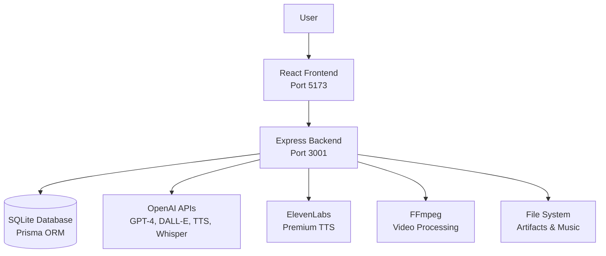
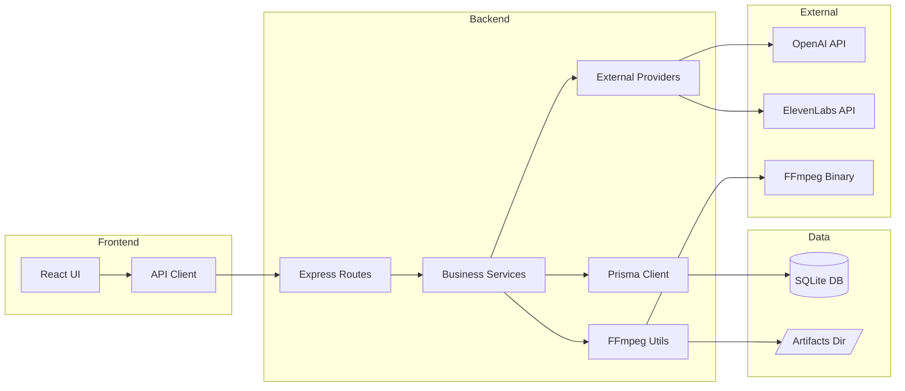
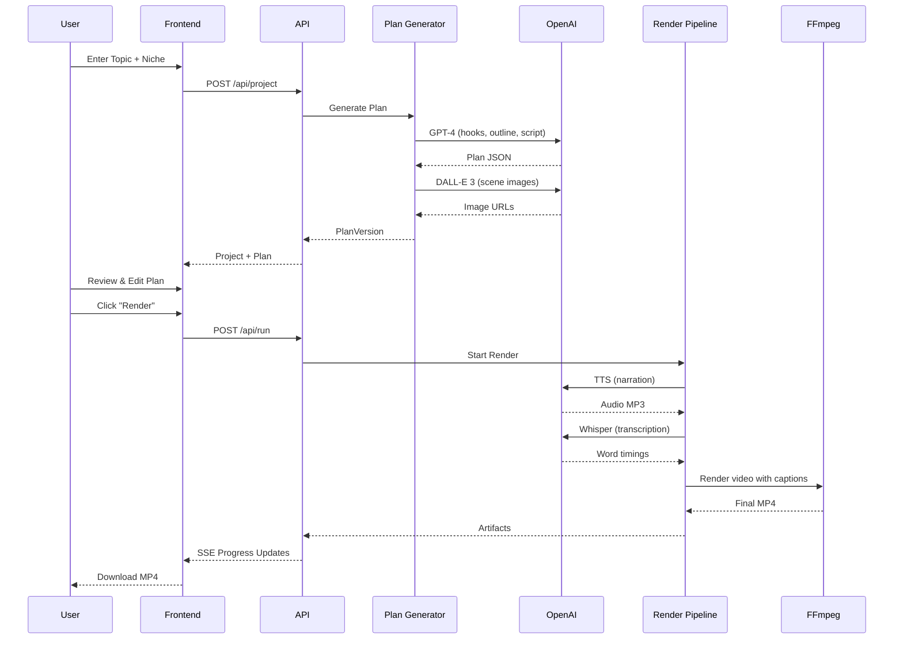

# Architecture Overview

TikTok-AI-Agent is a full-stack application for generating TikTok-style vertical videos using AI. This document describes the system architecture, components, data flow, and key design decisions.

## Table of Contents

- [System Overview](#system-overview)
- [Architecture Diagram](#architecture-diagram)
- [Components](#components)
- [Data Flow](#data-flow)
- [Technology Stack](#technology-stack)
- [Design Patterns](#design-patterns)
- [External Dependencies](#external-dependencies)

## System Overview

TikTok-AI-Agent follows a **3-stage workflow**:

1. **Plan Generation** - AI generates hooks, outline, script, and scene structure
2. **Studio Editing** - User reviews and edits the plan in the UI
3. **Render Execution** - FFmpeg + OpenAI APIs produce the final MP4 video

### High-Level Architecture



## Architecture Diagram

### Component Architecture



### Data Flow: Topic → Video



## Components

### Frontend (`apps/web/`)

**Framework**: React 18 + Vite + TypeScript

**Key Pages**:
- `/` - Quick Create (topic → plan)
- `/projects` - Project list
- `/plan-studio/:id` - Edit plan (hooks, outline, script, scenes)
- `/output/:runId` - View rendered video
- `/render-queue` - Active renders with progress

**State Management**: React hooks + local state (no Redux/Zustand)

**API Client**: `src/api/client.ts` - Typed fetch wrapper for backend

### Backend (`apps/server/`)

**Framework**: Node.js + Express + TypeScript

**Entry Point**: `src/index.ts` - `createApp()` and `startServer()`

**Routing**: 10+ route modules in `src/routes/`:
- `project.ts` - CRUD for projects
- `run.ts` - Render execution + SSE streaming
- `planVersion.ts` - Plan management
- `topicSuggestions.ts` - AI topic suggestions
- `health.ts` - Health checks
- And more...

**Services** (`src/services/`):

| Service | Purpose |
|---------|---------|
| `plan/planGenerator.ts` | GPT-4 plan generation with niche packs |
| `render/renderPipeline.ts` | 7-step render orchestration |
| `ffmpeg/ffmpegUtils.ts` | Video composition, audio mixing |
| `captions/captionsBuilder.ts` | ASS subtitle generation from Whisper |
| `providers/openai.ts` | OpenAI API client + cost tracking |
| `providers/elevenlabs.ts` | ElevenLabs TTS integration |
| `qa/qualityAnalyzer.ts` | Plan quality checks |
| `trends/topicSuggestions.ts` | Topic trend detection |

### Database (`apps/server/prisma/`)

**ORM**: Prisma 5.x  
**Database**: SQLite (dev) / PostgreSQL (production-ready)

**Core Models**:
- `Project` - Container for topic + niche + settings
- `PlanVersion` - Immutable plan snapshot (hooks, outline, script, scenes)
- `Scene` - Individual video segment with narration + visual prompt
- `Run` - Render execution with step tracking

See [Data Model](data-model.md) for detailed schema.

### Video Rendering Pipeline

**7-Step Process**:

1. **TTS Generate** - Convert narration to audio (OpenAI TTS or ElevenLabs)
2. **ASR Align** - Get word-level timestamps (Whisper)
3. **Images Generate** - Create scene images (DALL-E 3)
4. **Captions Build** - Generate ASS subtitles with word highlights
5. **Music Build** - Add background music from library
6. **FFmpeg Render** - Composite video with effects (zoom, pan, fade)
7. **Finalize Artifacts** - Verify outputs and generate thumbnail

**Pipeline Features**:
- **Idempotent**: Each step saves state; can resume from failures
- **SSE Streaming**: Real-time progress updates to frontend
- **Dry Run Mode**: Test without API calls (`APP_RENDER_DRY_RUN=1`)
- **Cancellation**: Active runs can be cancelled mid-execution

## Data Flow

### 1. Plan Generation Flow

```
User Input (Topic + Niche)
  ↓
Niche Pack Selection (12 packs with templates)
  ↓
GPT-4 Plan Generation
  - Hook options (3 variants)
  - Outline (scene summaries)
  - Script (narration for each scene)
  ↓
DALL-E 3 Image Prompts
  - Generated per scene based on visual style
  ↓
PlanVersion Stored in DB
  ↓
User Reviews in Plan Studio
```

### 2. Render Execution Flow

```
User Clicks "Render"
  ↓
Create Run Record (status: pending)
  ↓
[Step 1] TTS Generate
  - Call OpenAI TTS or ElevenLabs
  - Save MP3 to artifacts/
  ↓
[Step 2] ASR Align
  - Whisper transcription with word timestamps
  - Save JSON to artifacts/
  ↓
[Step 3] Images Generate
  - DALL-E 3 for each scene
  - Download and save PNGs
  ↓
[Step 4] Captions Build
  - Convert word timings to ASS format
  - Apply niche-specific styling
  ↓
[Step 5] Music Build
  - Select music from library
  - Mix with narration audio
  ↓
[Step 6] FFmpeg Render
  - Apply motion effects (zoom, pan, fade)
  - Overlay captions
  - Add audio
  - Output MP4
  ↓
[Step 7] Finalize Artifacts
  - Verify file existence
  - Generate thumbnail
  - Update Run status: done
  ↓
User Downloads Video
```

### 3. SSE (Server-Sent Events) Flow

```
Client Opens /api/run/:runId/stream
  ↓
Server Adds Client to SSE Connections Map
  ↓
Pipeline Executes Steps
  ↓
After Each Step:
  - Broadcast Progress Update
  - { type: 'progress', step, progress, message }
  ↓
On Completion/Error:
  - Broadcast Final State
  - { type: 'complete', finalStatus, artifacts }
  ↓
Client Receives Events in Real-Time
  ↓
Client Closes Connection
```

## Technology Stack

### Runtime
- **Node.js**: 20.19.0 or 22.12.0+
- **TypeScript**: 5.x (strict mode enabled)

### Frontend
- **React**: 18.x
- **Vite**: 7.x (dev server + bundler)
- **Tailwind CSS**: 3.x
- **React Router**: 7.x

### Backend
- **Express**: 5.x
- **Prisma**: 5.x (ORM)
- **Zod**: 3.x (validation)
- **Winston**: 3.x (logging)

### Video Processing
- **FFmpeg**: 4.4+ (system binary)
- **fluent-ffmpeg**: 2.x (Node wrapper)

### External APIs
- **OpenAI**: GPT-4, DALL-E 3, TTS, Whisper
- **ElevenLabs**: Premium TTS (optional)

### Testing
- **Vitest**: 4.x (unit + integration)
- **Playwright**: 1.x (E2E)
- **Supertest**: 8.x (API testing)

### DevOps
- **Docker**: Multi-stage builds
- **GitHub Actions**: CI/CD
- **Railway.app**: PaaS deployment

## Design Patterns

### Backend Patterns

**Dependency Injection**:
```typescript
// Services accept dependencies explicitly
export function createRenderPipeline(db: PrismaClient, providers: Providers) {
  // ...
}
```

**Service Layer**:
```typescript
// Routes delegate to services
router.post('/projects', async (req, res) => {
  const project = await projectService.create(req.body);
  res.json(project);
});
```

**Repository Pattern**:
```typescript
// Prisma client used as repository
const project = await prisma.project.findUnique({ where: { id } });
```

**Error Handling Middleware**:
```typescript
app.use((err, req, res, next) => {
  logError('Unhandled error', { error: err });
  res.status(500).json({ error: 'Internal server error' });
});
```

### Frontend Patterns

**Component Composition**:
```tsx
<PlanStudio>
  <HookSelector />
  <OutlineEditor />
  <SceneList>
    <SceneCard />
  </SceneList>
</PlanStudio>
```

**Custom Hooks**:
```typescript
const { project, loading } = useProject(projectId);
const { run, progress } = useRenderProgress(runId);
```

**API Client Abstraction**:
```typescript
export const api = {
  projects: {
    create: (data) => fetch('/api/project', { method: 'POST', body: JSON.stringify(data) }),
    // ...
  },
};
```

### Render Pipeline Pattern

**State Machine**:
```
pending → tts_generate → asr_align → images_generate →
captions_build → music_build → ffmpeg_render → finalize_artifacts → done
```

**Step Interface**:
```typescript
interface RenderStep {
  name: string;
  execute: (context: RenderContext) => Promise<void>;
  verify: (context: RenderContext) => boolean;
}
```

## External Dependencies

### OpenAI API

**Endpoints Used**:
- `POST /v1/chat/completions` - GPT-4 for plan generation
- `POST /v1/images/generations` - DALL-E 3 for scene images
- `POST /v1/audio/speech` - Text-to-speech
- `POST /v1/audio/transcriptions` - Whisper for alignment

**Cost Tracking**: All API calls logged with cost estimates

### ElevenLabs API

**Optional Premium TTS**:
- Higher quality voice synthesis
- More natural intonation
- Configured via `ELEVENLABS_API_KEY`

### FFmpeg

**System Dependency**:
- Must be installed on host system
- Called via `fluent-ffmpeg` Node wrapper
- Used for video composition, audio mixing, effects

**Effects Implemented**:
- `slow_zoom_in` / `slow_zoom_out`
- `pan_left` / `pan_right`
- `tilt_up` / `tilt_down`
- `fade` / `flash_cut`
- `glitch` / `static`

## Security Architecture

See [Security Implementation](security.md) for details.

**Key Security Features**:
- CORS with origin whitelisting
- Zod input validation on all routes
- Path traversal protection
- Rate limiting (100 req/15min in production)
- Helmet CSP headers
- No secrets in codebase (`.env` + `.gitignore`)

## Performance Considerations

**Bottlenecks**:
1. **OpenAI API Latency**: 10-30s for DALL-E image generation
2. **FFmpeg Rendering**: 30-120s depending on video length
3. **Database**: SQLite has limits for concurrent writes (use PostgreSQL in production)

**Optimizations**:
- Step-based pipeline allows progress tracking
- Idempotent steps enable retry without re-execution
- Dry-run mode for testing without API costs
- SSE for efficient real-time updates (vs polling)

## Scalability

**Current Limitations**:
- Single server instance (no horizontal scaling)
- In-memory SSE connection tracking
- SQLite not suitable for high-concurrency

**Future Improvements** (see [Roadmap](roadmap.md)):
- Queue-based render jobs (Bull/BullMQ)
- PostgreSQL for production
- Redis for SSE connection state
- CDN for artifact delivery
- Kubernetes deployment

## Monitoring & Observability

**Health Checks**:
- `GET /api/health` - Application status
- Database connectivity
- External provider availability

**Logging**:
- Winston structured logging
- JSON format in production
- Log levels: debug, info, warn, error

**Metrics** (not yet implemented):
- Render success/failure rates
- API latency
- Cost per video
- Queue depth

See [Operations Runbook](operations-runbook.md) for details.

## Related Documentation

- [Data Model](data-model.md) - Database schema
- [API Reference](api.md) - Complete endpoint documentation
- [Deployment Guide](deployment.md) - Production deployment
- [ADR 0001](adr/0001-monorepo-structure.md) - Monorepo decision
- [ADR 0002](adr/0002-render-pipeline-design.md) - Render pipeline architecture

---

**Last Updated**: 2026-01-31  
**Version**: 1.0.0
